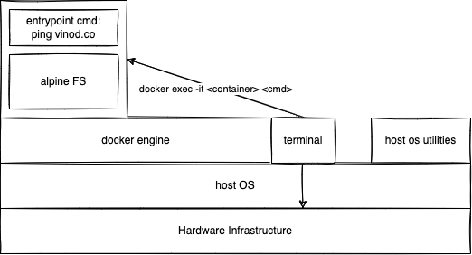
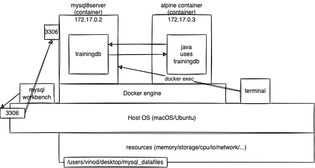
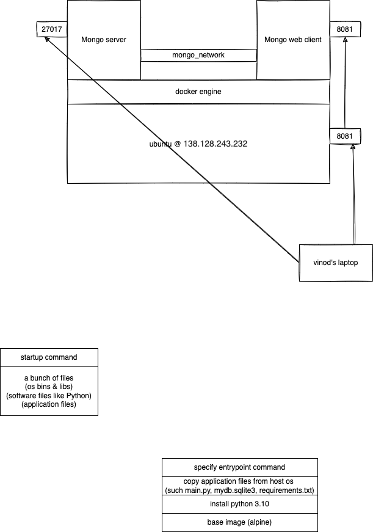

# Docker and Kubernetes training

### What is Docker?

-   Set of platform as a service (PaaS) products
-   Use OS-level virtualization
-   Delivers containers

### What is a container?

-   is a running process that simulates an bare minimum operating system that is required to run an application (for example, a web app written in go language)
-   it is an instance of "docker image" (like an OS image)
-   a container (exists only at the runtime) resides in your computers memory (RAM)

### What is a docker image?

-   a bunch of programs (like a java app), operating system files+utilities required to run the java program (eg, JDK)
-   For example, a java web app + jdk11 + alpine linux os
-   An image resides in your computer's storage


### Some of the basic docker commands:

-   `docker version`
    -   shows the docker client and docker server/daemon/engine information
-   `docker pull learnwithvinod/whois`
    -   downloads and stores the specified image in the image cache
-   `docker create --name ac1 alpine ping vinod.co`
    -   creates and stores a snapshot of the container with the specified image and the startup command. This created command, can be started using the `docker start ac1` command
-   `docker image ls` or `docker images`
    -   lists all available docker images on your system
-   `docker run learnwithvinod/whois`
    -   creates a container of the specified image, and runs the _**startup command**_, and once the command is over, the container is stopped and will be stored as a snapshot in the disk
    -   the `-d` or `--detach` flag will make the container run in background
-   `docker ps`
    -   lists all the running containers
    -   the `-a` or `--all` flag lists all the running and stopped containers
-   `docker start 61efcdde9d5f`
    -   starts the _stopped_ or _created_ container with id _61efcdde9d5f_
-   `docker stop 61efcdde9d5f`
    -   stops the running container with id _61efcdde9d5f_ by graceful shutdown
-   `docker kill 61efcdde9d5f`
    -   stops the running container with id _61efcdde9d5f_ immediately
-   `docker rm 61efcdde9d5f`
    -   removes the stopped container with id _61efcdde9d5f_
    -   the flag `-f` focefully removes the running/stopped container with id _61efcdde9d5f_
-   `docker logs 61efcdde9d5f`
    -   displays the console output produced on the STDOUT of the container





### To create an Oracle XE container

```
docker run --detach \
    --publish 1521:1521 \
    --publish 8080:8080 \
    --env ORACLE_ALLOW_REMOTE=true \
    --name oraclexe11g \
    oracleinanutshell/oracle-xe-11g
```

### To create a Mongodb server container

```
docker run -d \
    -p 27017:27017 \
    --name mongo-server \
    -v mongodb_data:/data/db \
    mongo
```

### To execute the Mongosh CLI on the above container

```
docker exec -it mongo-server mongosh
```

### Few useful mongodb commands

```
db // displays the current database
show dbs // displays all existing databases
use ev_db // creates a new db and switches to the same
show collections // displays the existing collections in the current database
// collection --> table in rdbms
// document --> row of a table
db.persons.insertOne({name: 'Vinod', age: 48, email: 'vinod@vinod.co'})
db.persons.insertOne({name: 'Vinod', age: 48, email: 'vinod@vinod.co', address: {city: 'Bangalore', state: 'Karnataka'}})

db.persons.find() // select * from persons
db.persons.find({}, {name: true, email: true, _id: false}) // select name, email from persons

```

### To create a Mongo web client that connects to Mongo server (two containers communicating)

```
docker run -d -p 8081:8081 \
    -e ME_CONFIG_MONGODB_SERVER=mongo-server \
    --link mongo-server \
    --name mongo-web-client \
    mongo-express
```

#### Linking two containers via network

```

docker network create mongo_network

docker network connect mongo_network mongo-server

docker run -d -p 8081:8081 \
    -e ME_CONFIG_MONGODB_SERVER=mongo-server \
    --network mongo_network \
    --name mongo-web-client \
    mongo-express

docker inspect mongo_network
```


