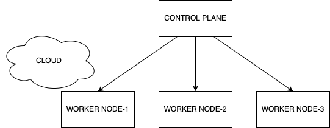

# Kubernetes

### What is k8s?

-   Open source software
-   Container orchastration tool
-   Deploy, manage, scale multiple containers in microservice world



### MINIKUBE

-   minikube is local Kubernetes, focusing on making it easy to learn and develop for Kubernetes.
-   All you need is Docker (or similarly compatible) container or a Virtual Machine environment, and Kubernetes is a single command away: minikube start

### Commands to install `minikube` on Ubuntu:

```
curl -LO https://storage.googleapis.com/minikube/releases/latest/minikube_latest_amd64.deb
dpkg -i minikube_latest_amd64.deb
```

### Commands to start minikube with docker driver

```
adduser sachin
usermod -aG docker sachin && newgrp docker
su sachin
minikube start --driver=docker
minikube status
minikube ip
minikube kubectl get pods
alias kubectl="minikube kubectl"
kubectl get pods
```


### Pods

-   A collection of containers shareing network, acting as the basic unit of deployment in K8s
-   All containers in a pod are scheduled on the same node (physical or cloud computer)

```
# fcs is the name of the pod (for flask-customer-service)
minikube kubectl -- run fcs --image=learnwithvinod/flask-customer-service:latest --port=8080
minikube kubectl -- get pods
minikube kubectl -- exec fcs -it --  ls -l
minikube kubectl -- describe pod fcs | more

alias kubectl="minikube kubectl --"

kubectl get pods
kubectl delete pod fcs

kubectl create deployment fcs-deployment --image=learnwithvinod/flask-customer-service:latest
kubectl get deployments,pods
kubectl expose deployment fcs-deployment --type=LoadBalancer --port=8080
minikube service fcs-deployment --url
curl http://192.168.64.2:30234/api/customers

```

### Labels

-   mechanism used to organize K8s objects (deployments, pods, services, namespaces)
-   Key/value pair

```yaml
apiVersion: v1
kind: Pod
metadata:
    name: pod-with-resource-limits
    labels:
        env: production
        created-by: Vinod
        team: ev
spec:
    containers:
        - name: fsc-container
          image: learnwithvinod/flask-customer-service:latest
          ports:
              - containerPort: 8080
          resources:
              limits:
                  memory: '64Mi'
                  cpu: '500m'
```

#### Some useful commands

-   kubectl get pods --show-labels
-   kubectl get pods --selector created-by=Vinod
-   kubectl get pods -l env=production
-   kubectl label pods twocontainers team=ev

### Deployments

-   Supervisor for pods, giving you fine-grained control over how and when a new pod version is rolled out or rolled back to a previous state

```yaml
apiVersion: apps/v1
kind: Deployment
metadata:
    name: fcs-deployment
spec:
    replicas: 3
    selector:
        matchLabels:
            app: fcs
    template:
        metadata:
            labels:
                env: development
                created-by: Vinod
                team: ev
                app: fcs
        spec:
            containers:
                - name: fcs
                  image: learnwithvinod/flask-customer-service:latest
                  env:
                      - name: APP_VERSION
                        value: '1.5.0'
                  ports:
                      - containerPort: 8080
                  resources:
                      limits:
                          memory: '64Mi'
                          cpu: '100m'
```

-   kubectl apply -f deployment.yml
-   kubectl get pods --show-labels
-   kubectl get pods -l app=fcs
-   kubectl delete deployment fcs-deployment
-   kubectl apply -f deployment.yml # make a new deployment after APP_VERSION is changed
-   kubectl rollout status deploy/fcs-deployment
-   kubectl rollout history deploy/fcs-deployment
-   kubectl rollout undo deploy/fcs-deployment --to-revision=2
-   kubectl delete deployment fcs-deployment # deletes deployment, pods and replicaset
-   kubectl get deployments,pods,replicaset

### Service

-   An abstraction for pods
-   Provide stable virtual IP address
-   Pods come and go with their own IP, service on the other hand will have a reliable IP so that clients may benefit out of it.

### Port forwarding

-   Allows us to quickly and temporarily access a service from your local environment, with out exposing the service

```yaml
apiVersion: apps/v1
kind: Deployment
metadata:
    name: fcs-deployment
spec:
    replicas: 3
    selector:
        matchLabels:
            app: fcs
    template:
        metadata:
            labels:
                app: fcs
        spec:
            containers:
                - name: fcs
                  image: learnwithvinod/flask-customer-service:latest
                  ports:
                      - containerPort: 8080
                  resources:
                      limits:
                          memory: '64Mi'
                          cpu: '100m'
---
apiVersion: v1
kind: Service
metadata:
    name: fcs-service
spec:
    ports:
        - port: 8888
          targetPort: 8080
    selector:
        app: fcs
```

-   kubectl port-forward services/fcs-service 7777:8888
-   [from your ubuntu shell] curl http://localhost:7777/api/customers
-   [from your windows browser] http://{ubuntu-ip}:7777/api/customers

### Volumes


-   a directory that is accessible to all containers running in a pod
-   in a container-local filesystem, the data is not preserved during restarts
-   in a volume the data is preserved across container restarts

#### Different types of volumes:

-   node-local types
    -   `emptyDir` or `hostPath`
-   file-sharing types
    -   `nfs`
-   cloud provider specific types
    -   `awsElasticBlockStore` or `azureDisk` or `gcePersistentDisk`
-   distributed file system types
    -   `glusterfs` or `cephfs`
-   special-purpose types
    -   `secret` or `gitRepo`

#### pod-with-volume.yaml

```yaml
apiVersion: v1
kind: Pod
metadata:
    name: pod-with-volume
    labels:
        name: pod-with-volume
spec:
    containers:
        - name: c1
          image: busybox
          volumeMounts:
              - mountPath: /tmp/c1volume
                name: volex # volume+example
          command:
              - 'sh'
              - '-c'
              - 'sleep 3600'
          resources:
              limits:
                  memory: '64Mi'
                  cpu: '100m'
        - name: c2
          image: busybox
          volumeMounts:
              - mountPath: /tmp/c2volume
                name: volex # volume+example
          command:
              - 'sh'
              - '-c'
              - 'sleep 3600'
          resources:
              limits:
                  memory: '64Mi'
                  cpu: '100m'
    volumes:
        - name: volex
          emptyDir: {}
```

Commands to try out:

```sh
kubectl apply -f pod-with-volume.yml

kubectl get deployments,pods,svc

kubectl describe pod pod-with-volume  ## check the entry for volumes

kubectl exec -it pod-with-volume -c c1 sh

```

Once you are inside the container's shell, try out these commands:

```sh
mount | grep c1volume

cd /tmp/c1volume

cat > names.txt
Vinod
Shyam
^d

cat names.txt

exit
```

Now, you may enter a shell of the container 2

```sh
kubectl exec -it pod-with-volume -c c2 sh

```

Once you are inside the container's shell, try out these commands:

```sh
mount | grep c1volume

cat /tmp/c2volume/names.txt

# make few changes to the names.txt using vi

exit
```

and then try this command to view the content of the same file via container c1:

```
kubectl exec -it pod-with-volume -c c1 cat /tmp/c1volume/names.txt
```
